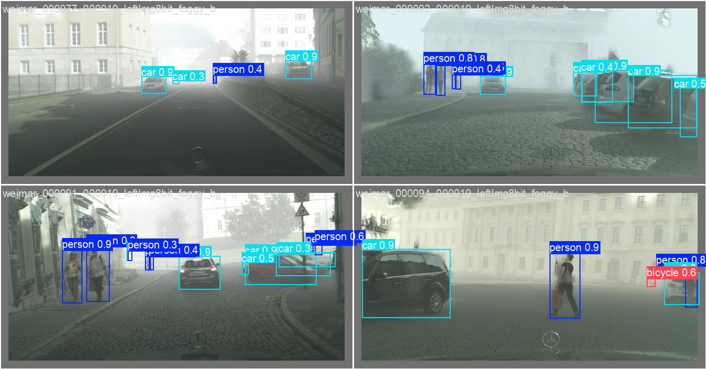
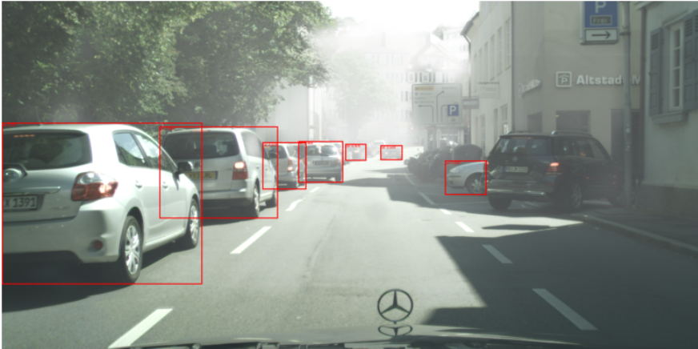
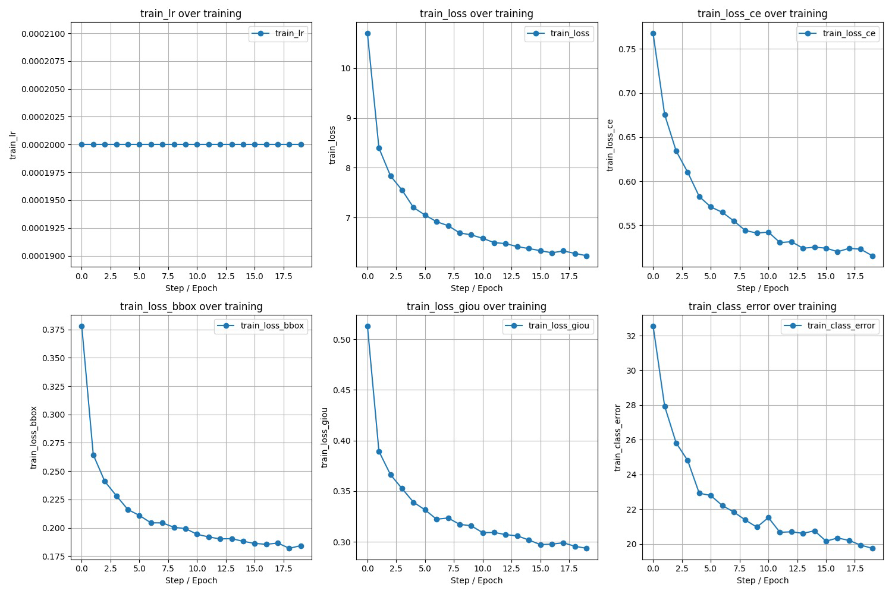
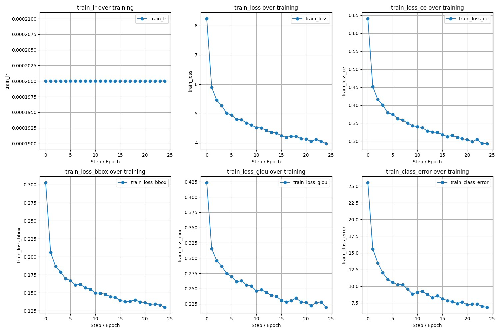

# Foggy Perception Benchmark

Robust object detection under adverse weather conditions using CNN-based, transformer-based, and open-vocabulary perception models.

<p align="center">
  
</p>


# Motivation

Object detection systems deployed in real-world autonomous driving and robotic perception pipelines often degrade significantly under adverse weather conditions such as fog, haze, and low visibility.

This project explores the robustness of modern detection paradigms under foggy urban environments through a progressive study of:

- CNN-based detectors
- Transformer-based detectors
- Open-vocabulary detection models

The goal is not only to compare architectures, but also to understand how different perception paradigms behave under visibility degradation.


# Project Overview

This repository benchmarks multiple modern object detection approaches on the Foggy Cityscapes dataset.

The project is structured as a progressive perception pipeline:

| Stage | Method | Paradigm |
||||
| Stage 1 | YOLO | CNN-based Detection |
| Stage 2 | Deformable DETR | Transformer-based Detection |
| Stage 3 | Grounding DINO | Open-Vocabulary Detection |


# Repository Structure

```text
foggy-perception-benchmark/
│
├── assets/
│   ├── detections/
│   └── training_curves/
│
├── scripts/
│   ├── grounding_dino.sh
│   ├── train_detr.sh
│   └── train_yolo.sh
│
├── src/
│   ├── models/
│   │   ├── grounding_dino.py
│   │   └── yolo_detector.py
│   │
│   └── training/
│       └── train_detr.py
│
├── requirements.txt
└── README.md
```


# Dataset

This project uses the Foggy Cityscapes dataset with COCO-style annotations.

The dataset contains:
- urban driving scenes
- dense fog conditions
- multi-class object annotations
- challenging visibility scenarios

Target classes include:

- person
- car
- truck
- bicycle
- bus
- motorcycle
- train


# Methodology

## 1. YOLO Baseline (CNN)

A YOLO-based detector was trained as the primary CNN baseline.

### Pipeline
- COCO → YOLO annotation conversion
- YOLO11 training
- validation inference
- qualitative analysis

### Goals
- establish a fast CNN baseline
- evaluate localization quality under fog
- compare against transformer methods


## 2. Deformable DETR (Transformer)

A transformer-based object detector was fine-tuned using multiple strategies.

### Fine-Tuning Experiments

| Strategy | Description |
|||
| Full Fine-Tuning | Entire model updated |
| Decoder-Only | Only decoder updated |
| Encoder-Only | Only encoder updated |

### Evaluation
- COCO mAP evaluation
- qualitative bounding-box analysis
- training stability comparison


## 3. Grounding DINO (Open-Vocabulary)

Grounding DINO was evaluated in a zero-shot perception setting.

### Goals
- evaluate open-vocabulary robustness
- analyze prompt-driven detection behavior
- explore generalized object grounding under fog

### Prompt Example

```text
car, person, bicycle, motorcycle, bus, truck
```


# Experiments

## YOLO Training

```bash
bash scripts/train_yolo.sh <dataset_root> <save_path>
```


## Deformable DETR Training

```bash
bash scripts/train_detr.sh <strategy_id> <dataset_root> <output_path>
```

Where:
- `1` → full fine-tuning
- `2` → decoder-only
- `3` → encoder-only


## Grounding DINO Inference

```bash
bash scripts/grounding_dino.sh <image_dir> <model_path> <output_json>
```


# Results

## YOLO Detection Results

<p align="center">
  
</p>


## Grounding DINO Zero-Shot Results

<p align="center">
  
</p>

<p align="center">
  
</p>

<p align="center">
  
</p>


# Training Curves

## Full Model Fine-Tuning

<p align="center">
  
</p>


## Decoder-Only Fine-Tuning

<p align="center">
  
</p>


## Encoder-Only Fine-Tuning

<p align="center">
  
</p>


# Quantitative Results

| Model | Paradigm | mAP |
||||
| Pretrained Deformable DETR | Transformer | 0.0445 |
| Full Fine-Tuned DETR | Transformer | 0.0037 |
| Decoder-Only DETR | Transformer | 0.0002 |
| Encoder-Only DETR | Transformer | 0.0003 |


# Key Observations

- Transformer detectors struggled under severe fog conditions without strong adaptation.
- Full fine-tuning produced better localization than partial fine-tuning.
- Grounding DINO demonstrated promising open-vocabulary robustness despite zero-shot inference.
- YOLO provided a strong practical baseline with stable detections and efficient inference.


# Installation

## Clone Repository

```bash
git clone <your_repo_url>
cd foggy-perception-benchmark
```


## Install Dependencies

```bash
pip install -r requirements.txt
```


# Requirements

Core dependencies:

- PyTorch
- torchvision
- transformers
- ultralytics
- pycocotools
- albumentations


# Future Work

- domain adaptation under adverse weather
- multi-modal perception fusion
- diffusion-assisted visibility restoration
- prompt tuning for Grounding DINO
- temporal perception consistency
- perception robustness benchmarking


# Acknowledgements

- HuggingFace Transformers
- Ultralytics YOLO
- IDEA Research Grounding DINO
- Foggy Cityscapes Dataset
